 # Git 基础教程

## 1.什么是git
### 1.1 git简史
Git是一个开源的**分布式版本控制系统**，用于敏捷高效地处理任何或小或大的项目。
Git 是 Linus Torvalds 为了帮助管理 Linux 内核开发而开发的一个开放源码的版本控制软件。
Git 与常用的版本控制工具 CVS, Subversion 等不同，它采用了分布式版本库的方式，不必服务器端软件支持。

 **什么是版本控制？**
什么是版本控制？我为什么要关心它呢？版本控制是一种记录一个或若干文件内容变化，以便将来查阅特定版本修订情况的系统。在本书所展示的例子中，我们仅对保存着软件源代码的文本文件作版本控制管理，但实际上，你可以对任何类型的文件进行版本控制。

如果你是位图形或网页设计师，可能会需要保存某一幅图片或页面布局文件的所有修订版本（这或许是你非常渴望拥有的功能）。采用版本控制系统（VCS）是个明智的选择。有了它你就可以将某个文件回溯到之前的状态，甚至将整个项目都回退到过去某个时间点的状态。你可以比较文件的变化细节，查出最后是谁修改了哪个地方，从而找出导致怪异问题出现的原因，又是谁在何时报告了某个功能缺陷等等。使用版本控制系统通常还意味着，就算你乱来一气把整个项目中的文件改的改删的删，你也照样可以轻松恢复到原先的样子。但额外增加的工作量却微乎其微。

**注：** Ctrl+Z 的效果是撤销，每次核销后都会变到以前的样子，就想比较相似版本控制，记录你提交的每次变化（历史版本）。

---

 **什么是分布式系统？**

想要了解点链接
https://baike.baidu.com/item/%E5%88%86%E5%B8%83%E5%BC%8F%E7%B3%BB%E7%BB%9F/4905336?fr=aladdin

### 1.2 git安装

**window安装**

下载安装包：
https://www.git-scm.com/download/
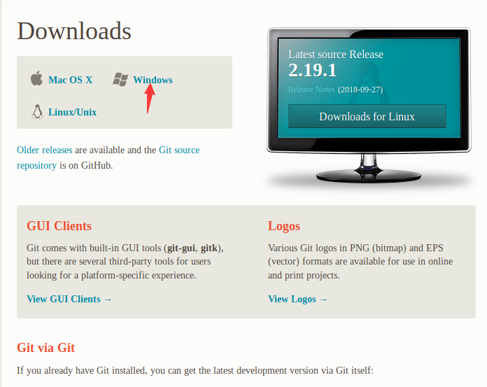

双击打开之后安装一路next.......直到完成。

**注：** 可以任意更改安装地方，应用不要都安装在C盘。

 **Linux安装**

**Ubuntu:**  

>$ sudo apt-get install git

相关详细配置可见：https://blog.csdn.net/qq282330332/article/details/51855252

**Centos:**   

>$ yum install git 

相关详细配置可见：
https://www.jb51.net/article/128153.htm


### 1.3 git初始操作（以window系统为例）

桌面空白处右击鼠标
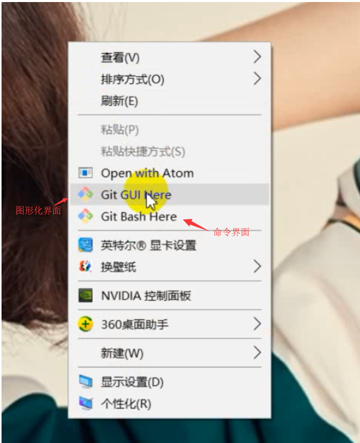

**注：** Git GUL Here 是图形化界面，图形化界面很丑很难控制。

下图为命令行界面

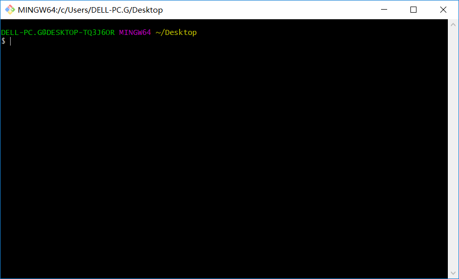

---

**初始化：**
初始化输入用户名和邮箱

    $ git config --global user.name "您的用户名"
    $ git config --global user.email "您的邮箱"

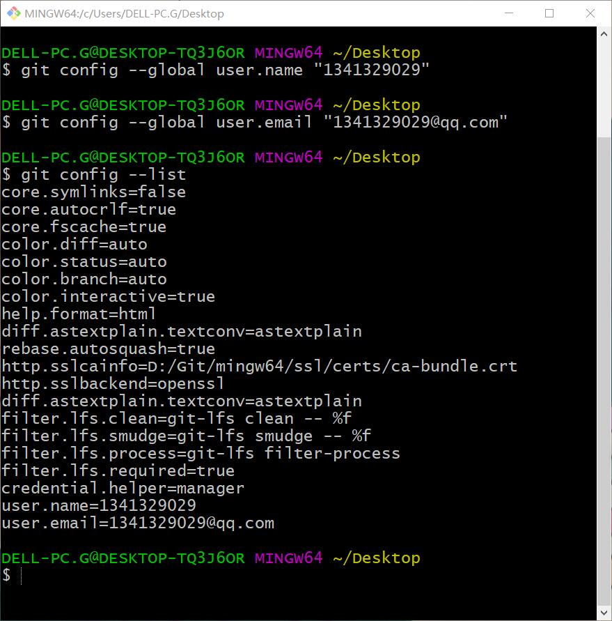


<br/>验证配置修改和有关更多信息和命令行选项

    $ git config --list
    $ git --help
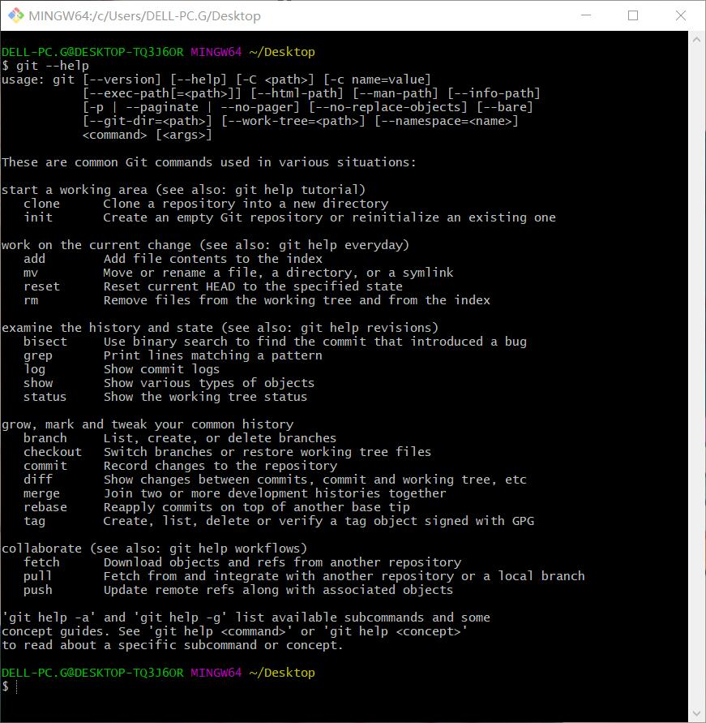

---
初始化默认编译器

    $git config --global core.editor 编译器名字/地址

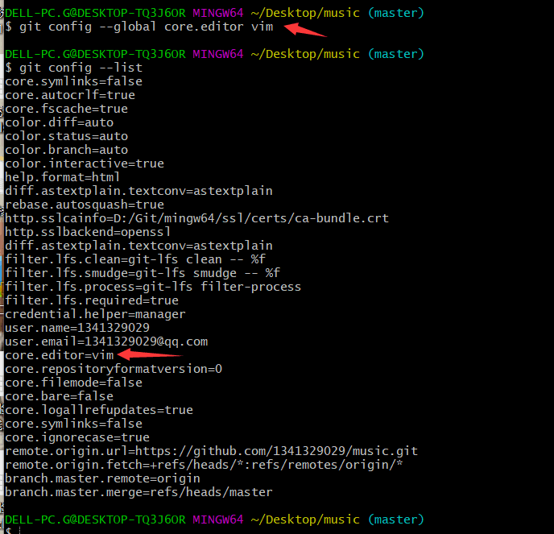

## 2.Github的使用和操作

### 2.1 什么是Github

gitHub是一个面向开源及私有软件项目的托管平台，因为只支持git 作为唯一的版本库格式进行托管，故名gitHub。

**详细请见：** https://baike.baidu.com/item/github/10145341?fr=aladdin


### 2.2 Github的登录和注册

**官网：** https://github.com/

注册：
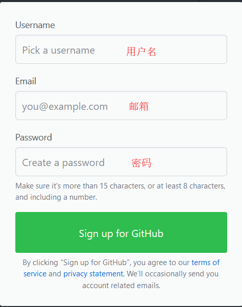

**注：** 与微信用户名类似，可以登录使用，不是进去后的博客名

**详细请见：** https://jingyan.baidu.com/article/4ae03de3d6f9c53eff9e6bdd.html

<b>Sign in</b>是登录<b>Sign up</b>是注册


点击Sign in 进入登录界面
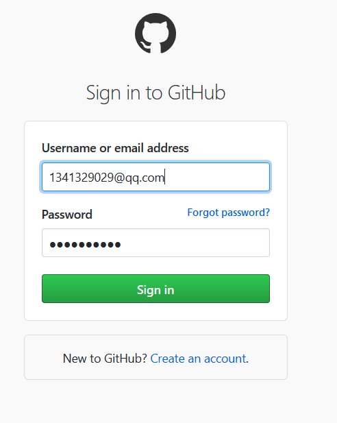

登录后出现主页面

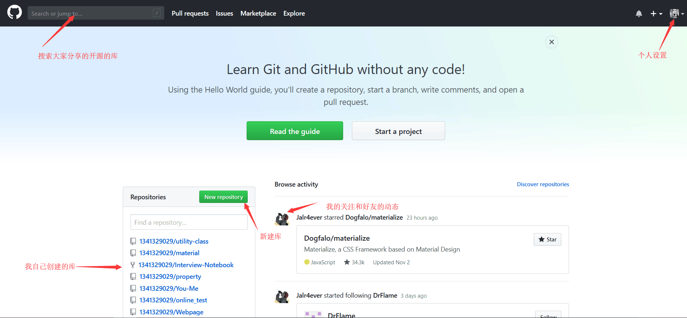

### 2.3 Github新建库

点击主页面新建库

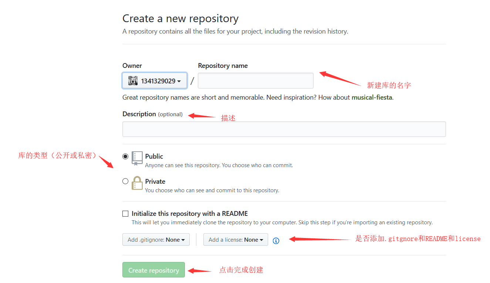

填写完毕点击完成创建

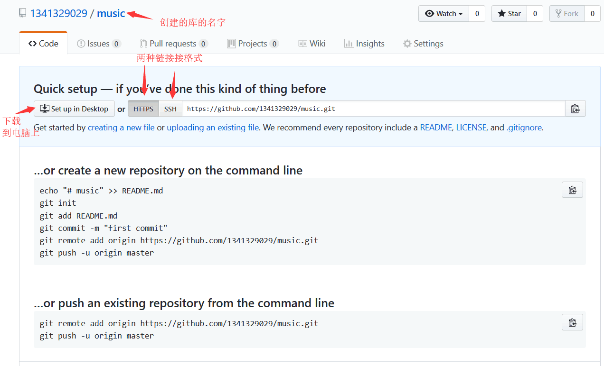


## 3.Git的操作及使用

### 3.1 Github与git连接（1）
基础Linux命令：

cd : 进入下级目录
ls： 显示目录下文件和文件夹
mkdir: 创建文件夹
rm : 删除


    $ mkdir 文件夹名字

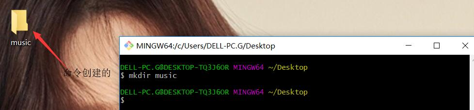

<br/>

---

显示目录下的文件

    $ls 

进入music文件夹下

    $cd music

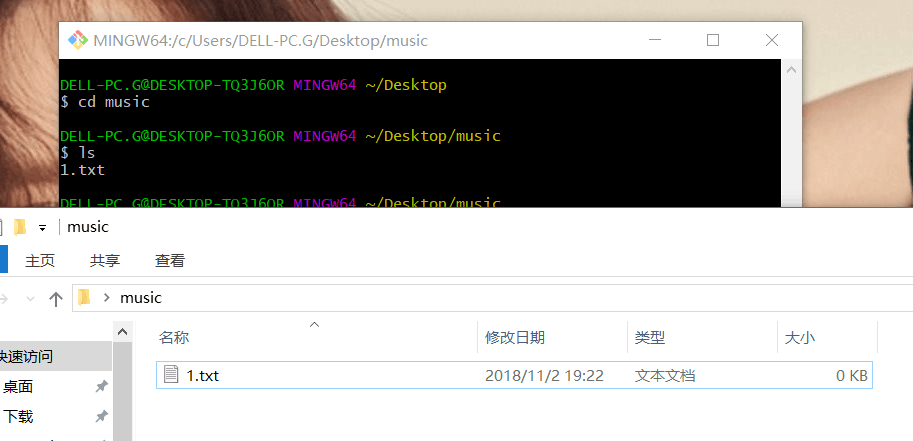

---

写入music到 README.md 文件中 

**注：** 文件md格式和不要求掌握

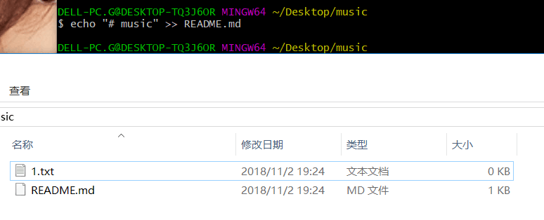

1.创建一个名为 .git 的子目录

    $ git init

该命令将创建一个名为 .git 的子目录，这个子目录含有你初始化的 Git 仓库中所有的必须文件，这些文件是 Git 仓库的骨干。 但是，在这个时候，我们仅仅是做了一个初始化的操作，你的项目里的文件还没有被跟踪。、

2.提交的文件

     $ git add +文件

此命令将要提交的文件的信息添加到索引库中(将修改添加到暂存区)，以准备为下一次提交分段的内容。 它通常将现有路径的当前内容作为一个整体添加，但是通过一些选项，它也可以用于添加内容，只对所应用的工作树文件进行一些更改，或删除工作树中不存在的路径了。

3.提交文件的描述

     $ git commit -m "描述"

4.添加远程仓库的关联

    $ git remote add origin 网址

5.推到远程库中

    $ git push -u origin master

使用本地引用更新远程引用，同时发送完成给定引用所需的对象。可以在每次推入存储库时，通过在那里设置挂钩触发一些事件。


    $ git init 
    $ git add README.md
    $ git commit -m "first commit"
    $ git remote add origin 网址
    $ git push -u origin master

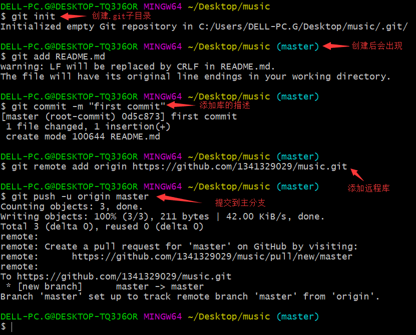

---

远程库显示

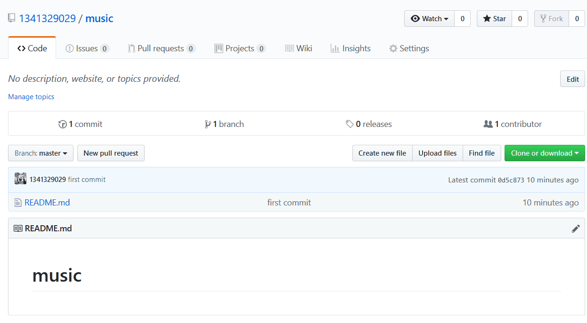

### 3.2 Github与git连接（2）

1.复制网址

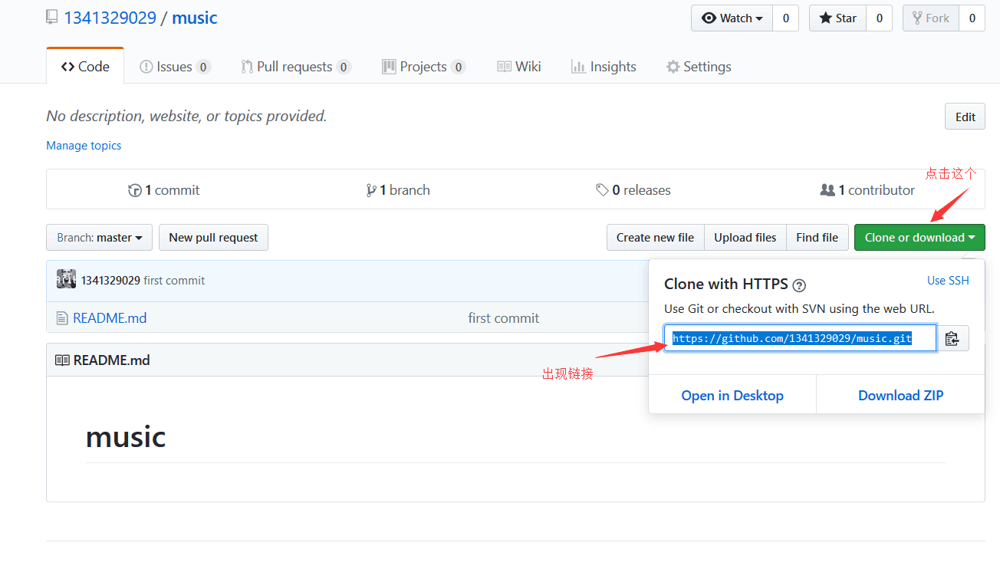

2.克隆

     $ git clone 网址

将存储库克隆到新创建的目录中，为克隆的存储库中的每个分支创建远程跟踪分支(使用git branch -r可见)，并从克隆检出的存储库作为当前活动分支的初始分支。

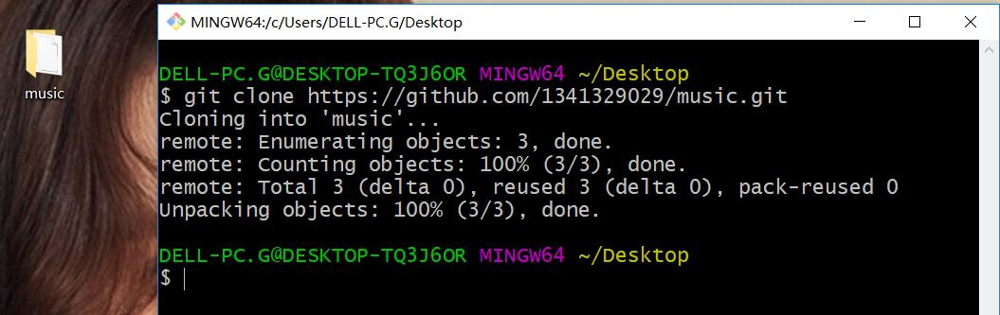

---

3.查看状态

     $ git status

git status命令用于显示工作目录和暂存区的状态。使用此命令能看到那些修改被暂存到了, 哪些没有, 哪些文件没有被Git tracked到。git status不显示已经commit到项目历史中去的信息。看项目历史的信息要使用git log.

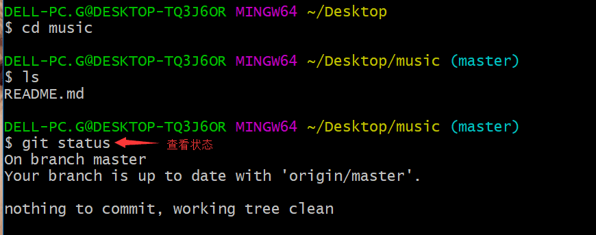

---

没有加到暂存区

 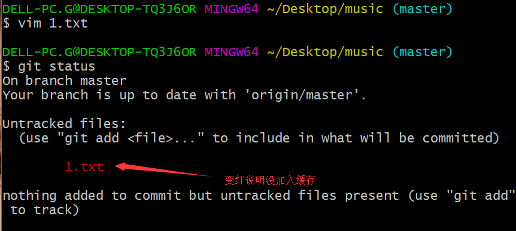

---

通过git add 加入暂存区

 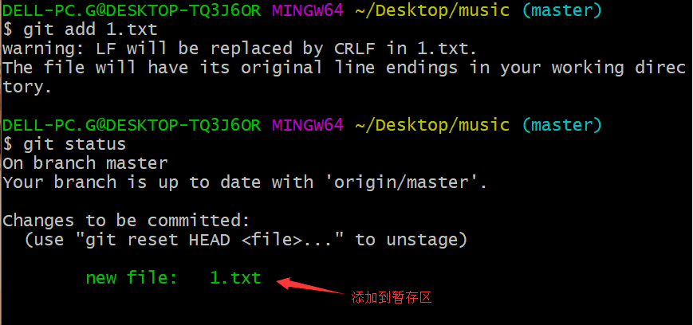

---

 4.添加描述，进行提交

    $ git commit -m ""
    $ git push -u origin master

 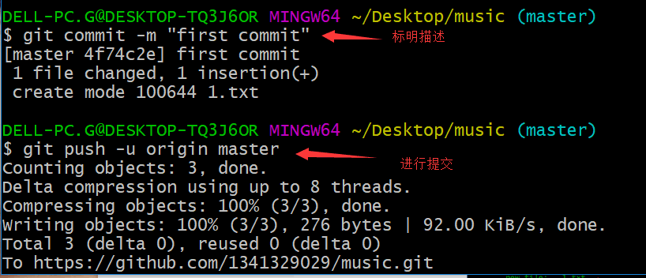

### 3.3 Github与git连接（3）--文件反复提交

1.新增文件2.txt

 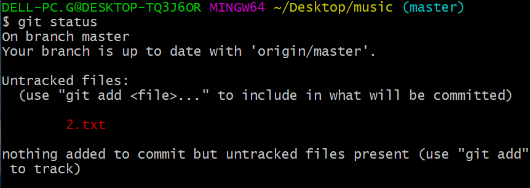

---

**注：** 在music文件夹中新增文件后查看状态显示红色

2.修改文件1.txt

 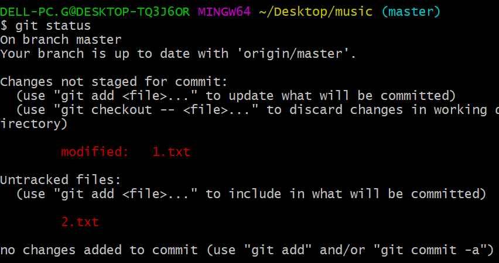

---

**注：** 在music文件夹中修改文件1.txt后查看状态显示红色并且前面有modified

 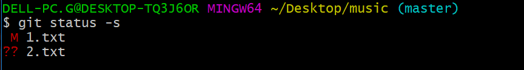

---

3.添加进暂存区

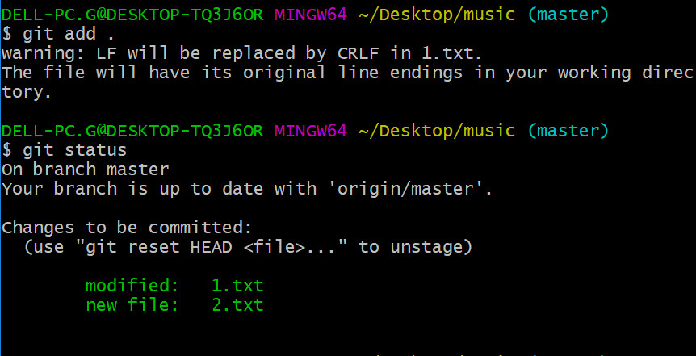

---

**注：** git add . 表示全部添加 ,  **.** 表示全部 ，添加暂存区域后会变成绿色 

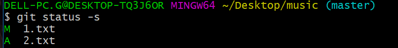

---

4.再 重新修改1.txt

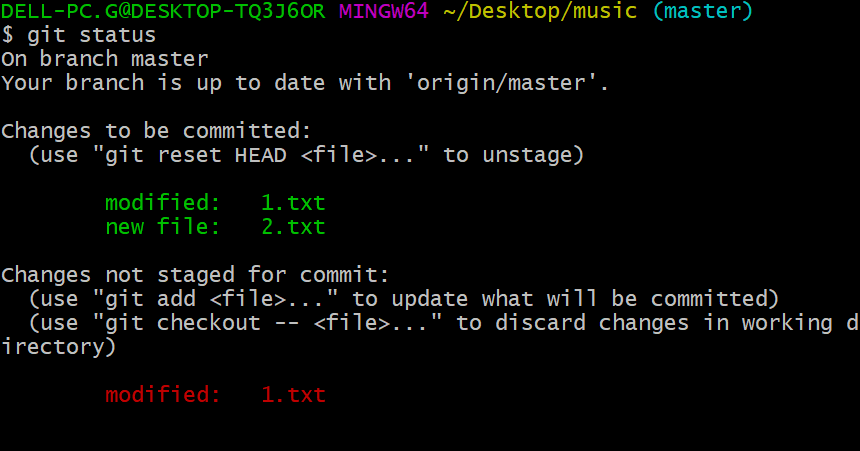

---

**注：** 上面绿色为暂存区中，如果1.txt再被更改下方还会出现红色的（第一次修改提交后再修改还会不同就会变红）

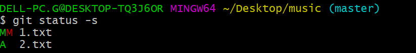

---

5.再次添加到暂存区并查看状态

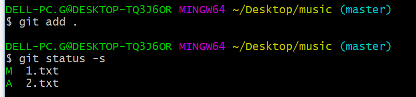

---

6.查看以往github 上的文件 和 文件信息

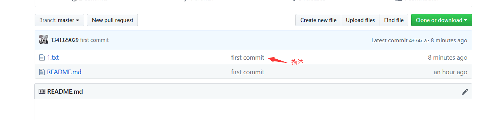

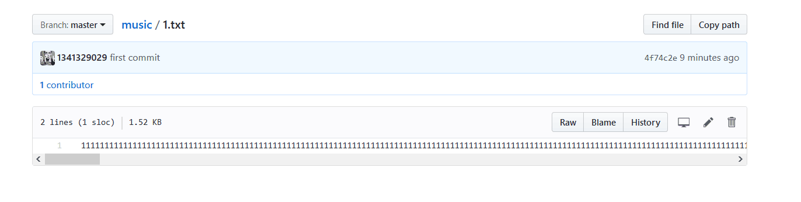

---

7.进行描述和提交

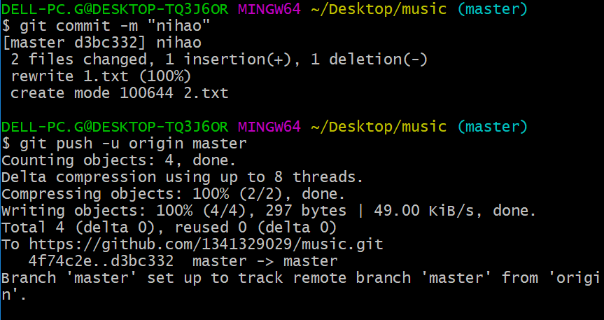

---

**注：**  描述也被更改了

8.查看现在的状态

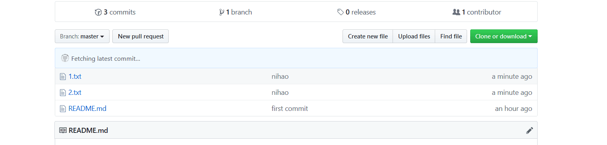
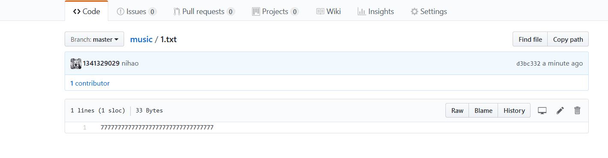
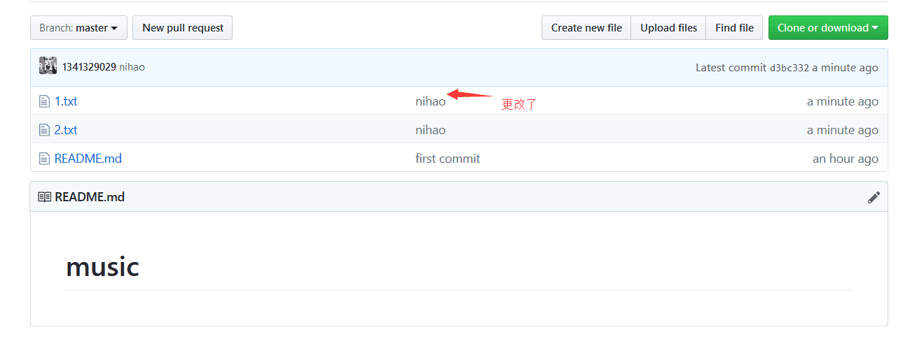


**注：**  文件1.txt的内容更改了，并且描述也都更改了

### 3.4  在Git仓库中的记录变更

#### 3.4.1 忽略文件

在使用Git的过程中，我们喜欢有的文件比如日志，临时文件，编译的中间文件等不要提交到代码仓库，这时就要设置相应的忽略规则，来忽略这些文件的提交。简单来说一个场景：在你使用git add .的时候，遇到了把你不想提交的文件也添加到了缓存中去的情况，比如项目的本地配置信息，如果你上传到Git中去其他人pull下来的时候就会和他本地的配置有冲突，所以这样的个性化配置文件我们一般不把它推送到git服务器中，但是又为了偷懒每次添加缓存的时候都想用git add .而不是手动一个一个文件添加，该怎么办呢？很简单，git为我们提供了一个.gitignore文件只要在这个文件中申明那些文件你不希望添加到git中去，这样当你使用git add .的时候这些文件就会被自动忽略掉。

    $ cat .gitignore
    * .a
  下面是样式格式：

    #               表示此为注释,将被Git忽略
    *.a             表示忽略所有 .a 结尾的文件
    !lib.a          表示但lib.a除外
    /TODO           表示仅仅忽略项目根目录下的 TODO 文件，不包括 subdir/TODO
    build/          表示忽略 build/目录下的所有文件，过滤整个build文件夹；
    doc/*.txt       表示会忽略doc/notes.txt但不包括 doc/server/arch.txt
**详细可见：** https://www.cnblogs.com/kevingrace/p/5690241.html

#### 3.4.2 查看已暂存和未暂存的变更

命令用于显示提交和工作树等之间的更改。此命令比较的是工作目录中当前文件和暂存区域快照之间的差异,也就是修改之后还没有暂存起来的变化内容。


    $ git diff 

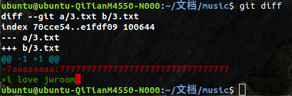

---

**注：** 红色区域为以往内容，绿色区域为更改后的内容

其他用法可参照：https://www.cnblogs.com/chenfulin5/p/8674565.html

#### 3.4.3 移除文件
当删除本地文件后查看状态会出现红色删除字样

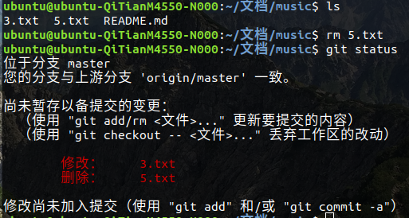

---
使用 git暂存区删除代码在暂存区删除

    $ git rm 文件

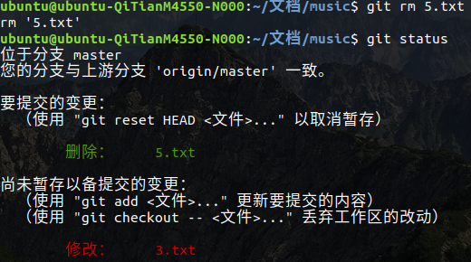

---

**注：** 红色区域删除变成绿色

再通过描述提交代码，文件在远程服务器上也会消失

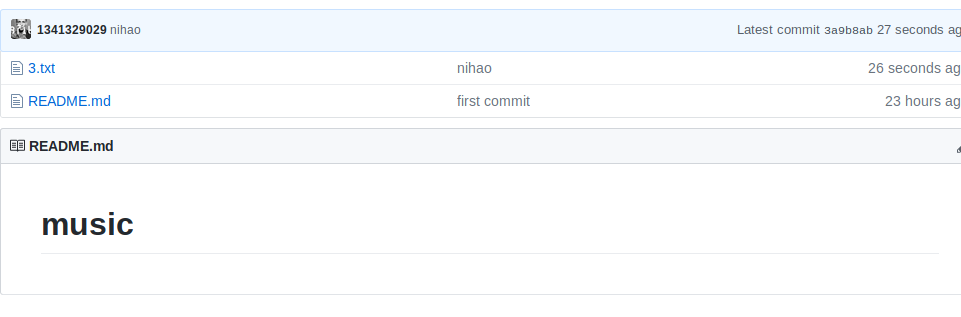

#### 3.4.4 移动文件（重命名描述）

git mv命令用于移动或重命名文件，目录或符号链接。

    $ git mv 旧名字 新名字

**注：** 可以当重命名使用

把一个文件：text.txt 移动到 mydir，可以执行以下操作 -

    $ git text.txt mydir

**注：** 可以更改目录

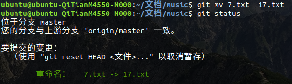

---

**注：** 查看状态如上图所示，出现重命名字样

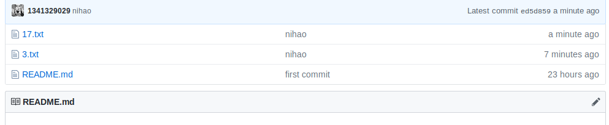

### 3.5  改动日志

#### 3.5.1 查看日志

在提交了若干更新之后，又或者克隆了某个项目，想回顾下提交历史，可以使用 `git log` 命令查看。

    $ git log 查看项目的日志
    $ git log <file> 查看某文件的日志
    $ git log . 查看本目录的日志


如果感觉log有点乱,可以git log --oneline,让日志单行显示.


也可以用git log --pretty=oneline


#### 3.5.2 比较版本不同

```git
$ git diff <版本X> <版本Y>
```


### 3.6  撤销操作

#### 3.6.1 未添加到暂存区的撤销(没有git add)

```
$ git checkout -- <file>
```


撤销更改，将本地文件还原为git 现存的版本

#### 3.6.2 已添加到暂存区的撤销(git add后)

    $ git reset HEAD <file>


#### 3.6.3 git commit之后进行撤销

```
$ git revert HEAD                  撤销前一次 commit
$ git revert HEAD^               撤销前前一次 commit
$ git revert commit （比如：fa042ce57ebbe5bb9c8db709f719cec2c58ee7ff）撤销指定的版本，撤销也会作为一次提交进行保存。
```


### 3.7 获取远程主机某个分支的更新

#### 3.7.1 获取远程主机某个分支的更新(合并)

```
$ git pull <远程主机名> <远程分支名>:<本地分支名>
```

命令用于从另一个存储库或本地分支获取并集成(整合)。`git pull`命令的作用是：取回远程主机某个分支的更新，再与本地的指定分支合并，它的完整格式稍稍有点复杂。


#### 3.7.2 获取远程主机某个分支的更新(先不合并)

```
$ git fetch origin
$ git log -p master..origin/master
$ git merge origin
```


#### 3.7.3 git fetch和git pull的区别

1. *git fetch*：相当于是从远程获取最新版本到本地，不会自动合并。

```
$ git fetch origin master
$ git log -p master..origin/master
$ git merge origin/master
```

以上命令的含义：

- 首先从远程的`origin`的`master`主分支下载最新的版本到`origin/master`分支上

- 然后比较本地的`master`分支和`origin/master`分支的差别

- 最后进行合并

  

2. *git pull*：相当于是从远程获取最新版本并`merge`到本地 

```shell
git pull origin master


Shell
```

上述命令其实相当于`git fetch` 和 `git merge`
在实际使用中，`git fetch`更安全一些，因为在`merge`前，我们可以查看更新情况，然后再决定是否合并。

### 3.8 版本切换

```
$ git reflog 查看版本变化
```


HEAD指向当前版本5d5df86, 

切换为head的前1版本,git reset --hard HEAD^切换为head的前2版本,git reset --hard HEAD^^ 

切换为head的前100版本,git reset --hard HEAD~100 

也可以利用版本号来切换,例 

```
$ git reset --hard 6207e59 
```


注意:版本号不用写那么长,能要能保证不与其他版本号重复就行. 

### 3.9 分支管理

#### 3.9.1分分支支有有什什么么用用**?**

在开发中,遇到这样的情况怎么办?
网站已有支付宝在线支付功能,要添加"微信支付".
修改了3个文件, wechat.php,pay.php

刚做到一半,突然有个紧急bug: 支付宝支付后不能修改订单状你需要立即马上修改这个bug,需要修改的文件是,ali.php,pa问题是:pay.php,已经被你修改过,而且尚未完成.

问题是:pay.php,已经被你修改过,而且尚未完成.直接在此基础上改,肯定有问题.
把pay.php倒回去? 那我之前的工作白费了.

此时你肯定会想: 在做"微信支付"时,能否把仓库复制一份,在此副本上修改,不影响原仓库的内容.修改完毕后,再把副本上的修改合并过去.

好的,这时你已经有了分支的思想.

前面见过的master,即是代码的主干分支,

事实上,在实际的开发中,往往不会直接修改和提交到master分支上

而是创建一个dev分支,在dev分支上,修改测试,没问题了,再把

如果有了分支,刚才的难题就好解决了,如下图:


在做"微信支付"时,我们创建一个wechat分支.
把wechat分支commit,此时,master分支内容不会变,因为分支不同。

当遇到紧急bug时,创建一个AliBug分支

修复bug后,把AliBug分支合并到master分支上.

再次从容切换到wechat分支上,接着开发"微信支付"功能,开发完毕后

把wechat分支合并到master分支上.

#### 3.9.2查看分支

***查看所有分支 git branch***

例：

```
$ git branch
master # 说明只有master分支,且处于master分支.
```

#### 3.9.3创建分支

创建dev分支 git branch dev

```
git branch dev # 创建dev分支
git branch #查看分支
dev

master # dev分支创建成功,但仍处于master分支
```

#### 3.9.4切换分支

切换到dev分支 git checkout dev
再次查看

```
$ git branch

dev
master # 已切换到dev分支上
```

#### 3.9.5 合并分支

当我们在dev上开发某功能,并测试通过后,可以把dev的内容合

例:
当前的readme.txt 内容为"so so",在dev分支下,添加一行"from dev"

并提交

```
git add readme.txt

git commit -m "mod in dev"
```

再次切换到master,查看readme.txt的内容,仍为'so so'
合并dev分支,git merge dev, 如下:

```
$ git merge dev
Updating c5364fe..412926b
Fast-forward
readme.txt | 1 +
1 file changed, 1 insertion(+)再次查看readme.txt的内容,已变为"soso from dev";
```

#### 3.9.6删除分支

```
$ git branch -d dev
Deleted branch dev (was 412926b).
```

#### 3.9.7 快快速速创创建建和和切切换换分分支支

git checkout -b dev # 创建dev分支并立即切换到dev分支
即起到git branch dev和git checkout dev的共同作用.

###  3.10远程仓库地址 

远程仓库的地址一般为https形状,或者是 git开头. 所谓远程仓库地址,即是给这些比较长的远程URL地址起一个短的别名.

#### 3.10.1查看远程仓库别名


#### 3.10.2 删除远程库别名

```
命令:git remote remove <远程库名> 

示例:git remote remove origin 
```

####  3.10.3 添加远程库别名

```
命令:git remote add <远程库名> <远程库地址> 

示例: 

git remote add origin https://git.oschina.net/lianshou/test.git 

注**:** 远程库名一般叫origin,但并非强制,你可以自己起名. 

例: 

git remote add online https://git.oschina.net/lianshou/test.git 
```

#### 3.10.4 修改远程库别名

```
git remote rename <旧名称> <新名称>
例:
git remote rename online oschina
```


